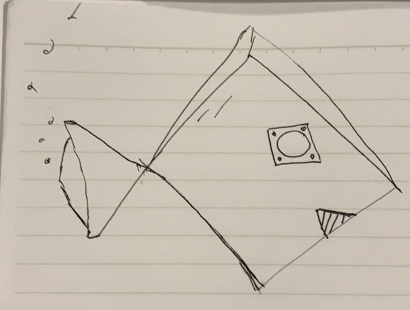
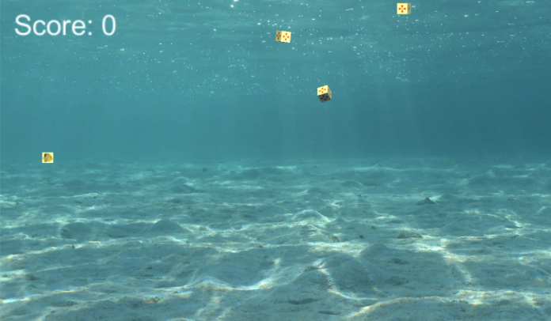
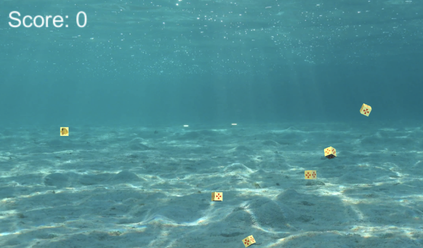
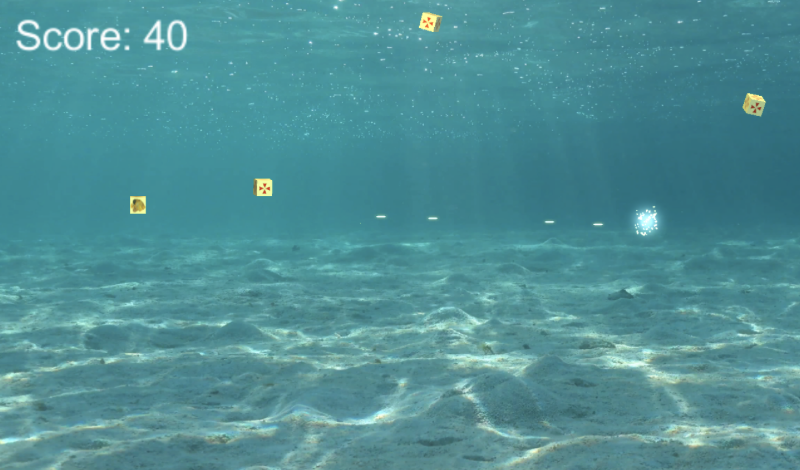
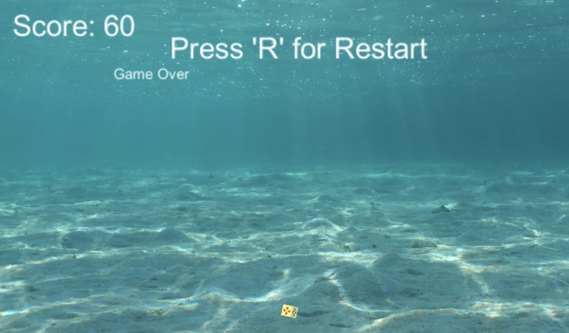
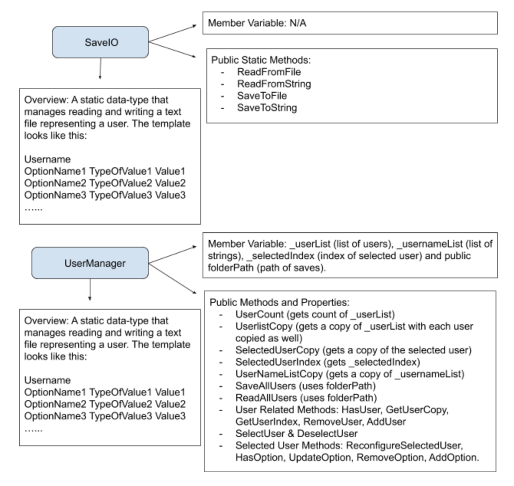

## Visit us
<a href="Swarthmore Github Enterprise">https://github.swarthmore.edu/cs71-s19/project-ilomeli1-rmuniu1-yqaddur1</a>

## About Catalyst

Inspired by the rising pressures of environmental issues, we seek to develop a 2D scroller game that highlights said issues through original gameplay with dramatic elements. Our game story starts out in a pre-apocalyptic underwater setting. The main character is a healthy fish, who starts out making her way through obstacles. The player is in control of the fish, and the goal of the player is to reach the end of the level and eventually “win” the game. As the game progresses, the underwater scenery changes styles to depict a post-apocalyptic world. We seek to show the progression via music changes, scenery aspects (background, foreground non-interactable objects), cut scenes between levels, and main character sprite changes. We seek to have the character morph into a mechanical fish towards the end. An element of loneliness and mystery will be incorporated by having no living things appear in the game except for the mechanical fishes that appear blurred in the background towards the end.

The game will be made using Unity engine. A rough & tentative architecture for the in-game objects attached below. In addition to those objects, we are making classes that are concerned with saving and loading save-files, another that is concerned with the input interface, some that will be used for loading the scenes and guiding them, and others for interactions between objects. Progression is level-based with transitions including text (monologues) fading in and out on the screen with dramatic music and elements incorporated. We are going to design the game so that coding expansions (additional levels, additional modes, animations/different transitions, web-based saving) and reconfigurations would be accessible and compatible with the code we end up with.

We hope, through this game, to raise awareness of environmental issues by giving the point of view of a fish in the sea disallowed from touching or interacting with humans production. We seek to achieve this and capture the experience of the player through a dramatic and mysterious atmosphere. Indeed, all of this is tentative and our time is limited but we hope to come up with a game capable of growing further.

## User Stories

### Minimum Viable Product

- Endless mode 
- 2D Scroller
- [Local] User progress and management
- Scorekeeping
- Player movement
  1. tain player to visible screen
  1. Contain player to visible screen
- Obstacle-player functionality
- Win
 - Idea: Have goal game object at end of game and “win” on contact
 1. Idea: Have goal game object at end of game and “win” on contact
- Menus
  1. Starting game menu
  2. Pause Menu

### Good to Have

- Story mode
- Changing background
  1. Per level
- Scrolling background
- Music/Sound effects
- Animate player
- Power-ups
- Changing [“evolving”] player
- Player projectile spawn

### Reach Goals

- Non-local user progress
- Parallax background
- Story mode with animated plot development scenes 
  1. Cut Scenes
- Leaderboard
- More Options
## High-level Design

### Back-End User Management

- Illustrated and explained in a later section.

### Game Controller 

- Keep track of game/level progress
  1. Score keeper
- Endless mode obstacle creation
- Handles level transitioning functionality
- Handles game over and check-points

### Mover

- In charge of gameobject behavior
  1. Movement which is not random, but defined
    - Ie: projectiles shoot straight, waste material falls from above
  1. Movement which is not random, but defined (ie: projectiles shoot straight, waste material falls from above)

### Player Controller

- Movement 
  1. Ability and restrictions
- Behavior (anything player-cued)
  1. ie: low down, speed up, projectile shooting

### Random Rotator

- General player/obstacle random behavior
  1. Useful for endless mode
  2. Idle (default) character behaviour

### Destroy At Contact

- Enter/Leave collider functionality
- Attached to game object’s who incite state change upon contact
- Cue visual effects

### Destroy At Time
- Delete remnant visual effect object’s after timer

## Specifications
### AddScore
  - Method used by game controller when updating private score variable
    1. ie: gain points when destroying gameobject

### Back-end User Management Interfaces

## Testing Plan
### Unity public variable
- We plan to test our code/logic through Unity’s public variable scheme. When a variable is public on unity, developers have the option to define its value outside the code. 
- We can ensure our expected behavior by playing with values and checking for the expected effect(s).
### Unit Tests
- We plan to test our expected user management back-end classes behavior using unit tests. (See the section related to back-end user management for information).
## Sprint plans
### Sprint 1
This sprint board will be represent by a github project board. It is the first development phase of our video game building progress. We initially looked to complete the following tasks:
- Fish-Bot-Classes entirely implemented with testing.
- A basic menu implemented and connected with a user manager.
- The basic structure for obstacles, bullets, fish, movement, and basic background.
Post Mortem: We were able to implement a basic endless game mode, which contains our basic logic for obstacles, bullets, movement, and a plain background. Next week we will plan to develop an intricate story mode level. We will also need to figure out user progress soon.
### Sprint 2
This spring board includes story mode implementation. Tentative plan:
- Implementation of checkpoints/saving
- One-time power up immunity 
- Text Transitions Scene(s)
- Stationary Traps
  1. Random, “idle” movement
- Make a premade level
- Scrolling background
<link rel="shortcut icon" type="image/x-icon" href="catalyst/docs/images/favicon.ico">

## UI Sketches/Illustrations: 

(Basic Aesthetics to be changed)

Player Eventual [“evolved”] Look

Endless mode player moving through water with falling endless hazards, player can move fish

Shooter functionality

Explosion on shot

User Interface, press R to restart endless mode

## Back-End User Management Illustration

Details of each class are included and documented in their corresponding files in github)

Every class has been fully unit tested. The documentation for the unit tests are found in the test classes in FishBot-Test in FishBotClasses in the main repository. Note that the game controller manages users by creating a static user manager and keeping track of the selected user and updating it. (82 Tests have been written so far)

